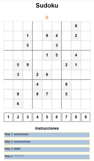
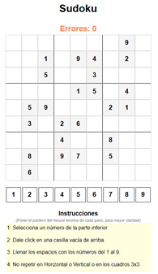

# SUDOKU01

[](https://www.youtube.com/watch?v=S4uRtTb8U-U)

## 01. Empezando con el archivo **`sudoku.html`**
1. Crear tres (3) archivos en la raíz del proyecto:
* **`sudoku.html`**
* **`sudoku.css`**
* **`sudoku.js`**

2. Empeando con el archivo **`sudoku.html`**, empezamos escribiendo 
`html` y seleccionamos `html:5`:
```html
<!DOCTYPE html>
<html lang="en">
<head>
  <meta charset="UTF-8">
  <meta name="viewport" content="width=device-width, initial-scale=1.0">
  <title>Document</title>
</head>
<body>
  
</body>
</html>
```
3. Cambiamos el `<title>` a `Sudoku`.
4. creamos el `<footer>` debajo del `</body>` e invocamos el `script` en el `<head>` y el link del `"stylesheet"` en el `<footer>`:
```html
<!DOCTYPE html>
<html lang="en">
<head>
  <meta charset="UTF-8">
  <meta name="viewport" content="width=device-width, initial-scale=1.0">
  <title>Sudoku</title>

  <script type="module" src="sudoku.js"></script>
</head>
<body>
  
</body>
<footer>
  <link rel="stylesheet" href="sudoku.css">
</footer>
</html>
```
5. En el `<body>` invocamos un `<h1>` y un `<h2>`:
```html
<body>
  <h1>Sudoku</h1>
  <hr>
  <h2 id="errors">0</h2>  
</body>
```
6. En el `<body>` de **`sudoku.html`**, ponemos el tablero de 9x9:
```html
  <!-- 9x9 board -->
  <div id = "board">
```
* Con javascript, vamos a llenar el contenido de este tablero
7. Ponemos mas en el `<body>`, debajo de `<div id="digits">`:
```html
  <br>
  <div id="digits"></div>
```

## 02. Seguimos con el archivo **`sudoku.css`**
1. Cargamos el tema que va a usar el `<body>`:
```css
body {
  font-family: Arial, Helvetica, sans-serif;
  text-align: center;
}
```
2. Luego como van a ser los `<hr>`:
```css
hr {
  width: 500px;
}
```
3. El `id = "errors"`:
```css
#errors {
  color: coral;
}
```
4. Como llenamos el `id = "board"`:
```css
#board {
  width: 450px;
  height: 450px;

  background-color: yellow;
  margin: 0 auto;
  display: flex;
  flex-wrap: wrap;
}
```
5. Hacemos estilos para `id="digits">`:
```css
#digits {
  width: 450px;
  height: 450px;

  background-color: yellow;
  margin: 0 auto;
  display: flex;
  flex-wrap: wrap;  
}
```

>[!NOTE]  
>Así se ve la pantalla en un browser:  
>

6. Ponemos mas en el **`sudoku.css`**, para una futura clase de nombre
`class = "tile"`:
```css
.tile {
  width: 48;
  height: 48;
  border: 1px solid lightgray;

  /* Text */
  font-size: 20px;
  font-weight: bold;
  display: flex;
  justify-content: center;
  align-items: center;
}
```
7. En el archivo **`sudoku.css`**, para una futura clase de nombre
`class = "number"`, similar al anterior:
```css
  width: 48;
  height: 48;
  border: 1px solid black;

  /* Text */
  font-size: 20px;
  font-weight: bold;
  display: flex;
  justify-content: center;
  align-items: center;  
```
>[!IMPORTANT]
>### Precondiciones para trabajar con `javascript`
>1. Tener el Editor [Visual Studio Code]>(https://code.visualstudio.com/insiders/).
>2. Extensiones insaladas dentro de 
>`Visual Studio Code`:  
>  * [Better Comments](https://marketplace.visualstudio.com/items?>itemName=aaron-bond.better-comments) 
>de [Aaron Bond](https://aaronbond.co.uk/).
>  * [Error Lens](https://marketplace.visualstudio.com/items?>itemName=usernamehw.errorlens) 
>de [Alexander](https://marketplace.visualstudio.com/publishers/usernamehw).
>  * [Javascript-Essentials](https://marketplace.visualstudio.com/items?itemName=Gydunhn.javascript-essentials)
>  de [Gydunhn](https://marketplace.visualstudio.com/publishers/Gydunhn),  
>  Este instala un paquete con:
>    * ESLint
>    * npm Intellisense 
>    * IntelliCode
>    * JavaScript (ES6) code snippets
>    * Debugger for Firefox
>    * Path Intellisense
>    * Formatting Toggle
>  * [Live Server](https://marketplace.visualstudio.com/items?itemName=ritwickdey.LiveServer)
>  de [Ritwick Dey](https://marketplace.visualstudio.com/publishers/ritwickdey).
>  * [Image preview](https://marketplace.visualstudio.com/items?itemName=kisstkondoros.vscode-gutter-preview)
>  de [Kiss Tamás](https://marketplace.visualstudio.com/publishers/kisstkondoros) 
>3. Instalar `nvm` descargando el instalador desde este sitio:
[nvm-setup.exe](https://github.com/coreybutler/nvm-windows/releases/download/1.1.12/nvm-setup.exe).
>4. Instalar el `node`, que a su vez
>trae el `npm` basado en este sitio: 
>[Instalar múltiples versiones de Node.js en Windows](https://rafaelneto.dev/blog/instalar-multiples-versiones-nodejs-windows/).  
>Con el `nvm` permite múltiples versiones
>del `node`.
>5. El programa `pnpm` es similar al `npm`, siendo un mejor >empaquetador.  
>Este lo puede conseguir con las instrucciones de este sitio
>[pnpm Installation](https://pnpm.io/installation).

>[!TIP]  
>### ESLint o Analizador estático de código fuente de `javascript`
>1. Tener instalado de forma global el `eslint`, con el comando:
>```bash
>npm install -g eslint
>```
>* **Esto solo se hace una vez y toca con el comando `npm`.**
>2. Instalar para el proyecto el paquete `standard`:
>```bash
>pnpm install standard -D
>```
>3. Se creó el archivo **`package.json`** con al menos esta información:
>```json
>{
>  "devDependencies": {
>    "standard": "^17.1.0"
>  }
>}
>```
>4. Crear el archivo **`.eslintrc.json`**, con este contenido:
>```json
> {
>   "extends": ["standard"],
>   "rules": {
>     "semi" : [2, "always"],
>     "comma-dangle": [2, "always-multiline"] 
>   }
> }
>```
>4. Presiono en `Visual Studio Code` las teclas: 
> [`Ctrl`] + [`Shift`] + [`P`]  
> y selecciono o busco `Restart ESLint Server`

## 03. Ponemos el tablero y los números desde **`sudoku.js`**

>[!TIP]  
>Esta es la solición propuesta para implementar en el archivo 
>**`sudoku.js`**:  
>

1. Empezamos inicializando las variables a utilizar:
```js
const numSelected = null;
const tileSelected = null;
const errors = 0;
const board = [
  '--74916-5',
  '2---6-3-9',
  '-----7-1-',
  '-586----4',
  '--62--187',
  '9-4-7---2',
  '67-83----',
  '81--45---',
];
const solution = [
  '387491625',
  '241568379',
  '569327418',
  '758619234',
  '123784596',
  '496253187',
  '934176852',
  '675832941',
  '812945763',
];
```
2. Creamos el manejo de `window.onload`, llamando una función de
nombre `setGame()`:
```js
window.onload = () => {
  setGame(); // Llamo esta función
};
```
3. Hacemos la función que estamos llamando:
```js
const setGame = () => { };
```
4. Empezamos con un ciclo `for` dentro del método `setGame()`:
```js
  for (let i = 1; i <= 9; i++) {}
```
5. En el ciclo `for` vamos a poner los números del 1 al 9 y luego
ponerlos como un `<div>` en pantalla, como un hijo de `id = "digits"`:
```js
  for (let i = 1; i <= 9; i++) {
    // <div id="1">1</div> en js
    const numberList = document.createElement('div');
    numberList.id = i; // definimos el `id`
    numberList.innerText = i; // El texto a mostrar
    numberList.classList.add('number'); // le asignamos la clase
    // Ponemos en pantalla como hijo de `id = "digits"`
    document.getElementById('digits').appendChild(numberList);
  }
```

>[!WARNING]  
>Corregí en **`sudoku.css`** las clases `.tile` y `.number`, las
>propiedades de `width:` y `height:` agretando la partícula `px`,
>después del número o el valor;

6. En el archivo **`sudoku.css`**, le agregamos un espacio en lo
relacionado a la clase `.number` y cambiamos el `width:` y el `height:`:
```css
.number {
  width: 44px;
  height: 44px;
  border: 1px solid black;
  margin: 2px;

  ...
}
```

>[!NOTE]  
>Hasta acá así se ve el juego en el browser:  
>

7. Hacemos algo similar para mostar la tabla en pantalla
en el archivo **`sudoku.js`**:
```js
for (let x = 0; x < 9; x++) {
  for (let y = 0; y < 9; y++) {
    // <div id="0-0"></div>
    const tileList = document.createElement('div');
    tileList.id = x.toString() + '-' + y.toString(); // definimos `id`
    tileList.classList.add('tile'); // le asignamos la clase
    // Ponemos en pantalla como hijo de `id = "board"`
    document.getElementById('board').appendChild(tileList);
  }
}
```

8. Quitamos de **`sudoku.css`** las lineas de 
`background-color: yellow;`, tanto en el `#board`, como en el 
`#digits`.

>[!NOTE]  
>Así se ve el tablero en el browser hasta el momento:  
>

>[!WARNING]  
>Como se ejecutaron elementos de `npm` y/o `pnpm`, este genera un 
>gigantesco directorio de nombre "`node_modules`", por tanto se deben
>crear el archivo **`.gitignore`**, con al menos esta información, así 
>se evita subir información innecesaria al repositorio:
>```py
># Logs
>logs
>*.log
>npm-debug.log*
>yarn-debug.log*
>yarn-error.log*
>pnpm-debug.log*
>lerna-debug.log*
>pnpm-lock.*
>package-lock.*
>
>node_modules
>dist
>dist-ssr
>*.local
>
># Editor directories and files
>.vscode/*
>!.vscode/extensions.json
>.idea
>.DS_Store
>*.suo
>*.ntvs*
>*.njsproj
>*.sln
>*.sw?
>```

## 04. Empezamos el juego y sus reglas en **`sudoku.js`**
1. Creamos la función `selectNumber()`, por ahora vacía:  
`const selectNumber = () => {}`
2. En el método `setGame()`, añadimos al `numberList` la _escucha_ 
del `'click'`, justo debajo del `innerText = i`, llamando la nueva
función:
```js
    numberList.addEventListener('click', selectNumber);
```
3. Cada ve que seleccionamos un número, cambiamos el color de la 
casilla basados en la clase `number-selected` en el archivo
 **`sudoku.css`**:
```css
.number-selected {
  background-color: gray;
}
```
>[!CAUTION]  
>Inicialmente la función la declaré como `const selectNumber = () => {}`
>pero no funciona, toca cambiar a `function selectNumber () {}`

4. Ahora bien la clase no existe, la hacemos aparecer en el archivo
**`sudoku.js`**, en el método `selectNumber()`:
```js
function selectNumber () {
  numSelected = this; // asigno el valor de `numberList`
  numSelected.classList.add('number-selected');
};
```
* Cada vez que haga click al número de abajo, se pone de fondo `gray`.

5. En la función `selectNumber()`, antes de crear la clase 
`'number-selected'`, preguntamos si es `null` para eliminar dicha clase:
```js
function selectNumber () {
  if (numSelected != null) {
    numSelected.classList.remove('number-selected');
  }
  numSelected = this; // asigno el valor de `numberList`
  numSelected.classList.add('number-selected'); // sudoku.css
};
```

>[!WARNING]  
>El punto 5 no funciona o genera errores, solo es corregir la
>definición de estas variables en las primeras líneas, es decir
>cambiar el `const` por el `let`:
>```js
>let numSelected = null;
>let tileSelected = null;
>
>let errors = 0;

6. Agregamos otra función de nombre `selectTile()`, con este código:  
```js
function selectTile () {
  if (numSelected) {
    this.innerText = numSelected.id; // Asigno el valor a la cuadrícula
  }
}
```
7. En el método `setGame()`, añadimos al `tileList` la _escucha_ 
del `'click'`, justo debajo del `tileList.id = `, llamando la nueva
función `selectTile()`:
```js
    tileList.addEventListener('click', selectTile);
```
8. Mejoramos con una condición en el método `selectTile()`:
```js
function selectTile () {
  if (numSelected) {
    if (this.innerText !== '') return; // Si tiene datos no hace nada
    this.innerText = numSelected.id;// Asigno el valor a la cuadrícula
  }
}
```
9. Ahora poblamos las cuadrículas con los valores de `board`, en
el archivo **`sudoku.js`**, en el método `setGame()` debajo de
`tileList.id =`, ponemos esto:
```js
      if (board[x][y] !== '-') {
        tileList.innerText = board[x][y];
      }
```

>[!WARNING]  
>### Se debe corregir la variable `board`, pues faltaba una fila.

>[!TIP]  
>Una forma de recorrido por lo hijos de un HTML basados en el padre
>para borrar el nombre de la clase.
>```js
>const removeChildClass = (fatherId, className) => {
>  const fatherElement = document.getElementById(fatherId);
>  for (const childElement of fatherElement.children) {
>    if (childElement.classList.contains(className)) {
>      childElement.classList.remove(className);
>    }
>  }
>};
>```

## 05. Completando el juego de forma manual
1. En el archivo **`sudoku.css`** invocamos una clase de nombre
`class = 'tile-start'`:
```css
.tile-start {
  background-color:whitesmoke;
}
```
2. En el archivo **`sudoku.js`** en el método `setGame()`, cuando se
está creando el `Tablero 9x9`, dentro del condicional 
`if (board[x][y] !== '-')`, añadimo esto:
```js
      if (board[x][y] !== '-') {
        tileList.innerText = board[x][y];
        tileList.classList.add('tile-start');
      }
```
3. En el archivo **`sudoku.css`**, añadimos dos clases que son
`horizontal-line` y `vertical-line`:
```css
.horizontal-line {
  border-bottom: 1px solid black;
}

.vertical-line {
  border-right: 1px solid black;
}
```
4. En el archivo **`sudoku.js`** en el método `setGame()`, cuando se
está creando el `Tablero 9x9`, agregamos un condicional, para poner
las `.horizontal-line` y las `.vertical-line`:
```js
      if (x === 2 || x === 5) {
        tileList.classList.add('horizontal-line');
      }
      if (y === 2 || y === 5) {
        tileList.classList.add('vertical-line');
      }
```

>[!NOTE]  
>Así se ve hasta el momento el juego en pantalla:  
>

5. Empezamos el proceso para comparar con la solución, en 
**`sudoku.js`**, dentro del método `selectTile()`, creamos una
variable con las coordenadas en forma de arreglo `string`:
```js
    const coords = this.id.split('-'); // Crea un arreglo
```
6. Se requiere convertir dichos valores a enteros en dos variables:
```js
    const x = parseInt(coords[0]);
    const y = parseInt(coords[1]);
```
7. Si es igual a la solución lo asigno a la cuadrícula:
```js
    if (solution[x][y] === numSelected.id) {
      this.innerText = numSelected.id;
    }
```
8. Elimino o comento la línea anterior en el método `selectTile()` 
con las asignación `this.innerText = numSelected.id;`.
9. Agregamos un `else` a la condición 
`if (solution[x][y] === numSelected.id)`:
```js
    if (solution[x][y] === numSelected.id) {
      this.innerText = numSelected.id;
    } else {
      errors += 1; // Incremento los errores.
      // Lo muestro en pantalla el valor incrementado
      document.getElementById('errors').innerText = errors;
    }
```

## 06. Iniciando el método `testAuto1()` con la carga de los 3 arreglos

1. Creo una función de nombre `testAuto1()`, por ahora con un 
`console.log`:
```js
const testAuto1 = () => {
  console.log('testAuto1');
};
```
2. Creo un botón invisible en las coordenadas (4,4), en centro de la
cuadrícula, en el método `selectTile ()`, cuando no he seleccionado
número alguno:
```js
  if (numSelected) {
    ...
  } else if (this.id === '4-4') { testAuto1(); } // Botón invisible
```
3. Creamos 3 arreglos para las validaciones automáticas `rows`, 
`columns`, `squares`, debajo de `solution`:
```js
  const rows = []; // Filas del `board`
  const columns = []; // Columnas del `board`
  const squares = []; // Cuadros 3x3 del `board`
```
4. Creamos un método de nombre `loadingArrays()`, para la carga de los
arreglos.
5. dentro del método `testAuto1()`, llamamos el método 
`loadingArrays()`.
6. Dentro del método `loadingArrays()` hago un recorrido por la matriz
`board`, para cargar los tres arreglos:
```js
  let i = 0; // Número de cada cuadro 3x3
  let delta = 0; // Incremento de cada cuadro 3x3
  // Recorrido para cargar los tres arreglos o matrices
  for (let x = 0; x < 9; x++) {
    for (let y = 0; y < 9; y++) {
      if (x === 0) {
        columns.push(board[x][y].replace('-', '0')); // Creo celda array
        rows.push(board[y].replaceAll('-', '0')); // Creo celda array
      } else {
        columns[y] = columns[y].concat(board[x][y].replace('-', '0'));
      }
      // if ((x===0 || x===3 || x===6) && (y===0 || y===3 || y===6))
      if ([0, 3, 6].includes(x) && [0, 3, 6].includes(y)) {
        squares.push(board[x][y].replace('-', '0')); // Creo celda array
        if ([0, 3, 6].includes(x)) delta = x;
        // console.log(`x,y: (${x},${y}) square:${squares.length} `);
      } else {
        i = Math.floor((x + delta) / 3) + Math.floor((y + delta) / 3);
        // console.log(`x,y: (${x},${y}) i:${i} Delta:${delta}`);
        squares[i] = squares[i].concat(board[x][y].replace('-', '0'));
      }
    }
  };
  console.log('rows: ', rows);
  console.log('columns: ', columns);
  console.log('squares:', squares); 
```

>[!NOTE]  
> para el ejercicio este sería la lista de valores en cada arreglo:
>* rows:  ['007491605', '200060309', '000007010', '058600004', '006200187', '003000009', '904070002', '670830000', '810045000']
>* columns: ['020000968', '000500071', '700863400', '400620080', '960000734', '107000005', '630010000', '001080000', '590479200']
>* squares: ['007200000', '491060007', '605309010', '058006003', '600200000', '004187009', '904670810', '070830045', '002000000']
>* Basados en el arreglo de `board`:  
>`007491605`  
>`200060309`  
>`000007010`  
>`058600004`  
>`006200187`  
>`003000009`  
>`904070002`  
>`670830000`  
>`810045000`  


## 07. Creamos el método `solveSudoku()`
>[!TIP]  
>Basados en el siguiente video, vamos a probar la solución:  
>[]()
[](https://www.youtube.com/watch?v=3nZ45g5yhG0)
1. Creamos una variable para almacenar lo vacío y un arreglo de 
valores posibles, debajo del método `testAuto1()`:
```js
const EMPTY = '-';
const possibleNumbers = ['1', '2', '3', '4', '5', '6', '7', '8', '9'];
```
2. Creamos la función `solveSudoku`, con el parámetro del `board`,
por ahora con unos `console.log`:
```js
const solveSudoku = (puzzle) => {
  console.log('puzzle:', puzzle);
  console.log(EMPTY, possibleNumbers);
};
```
3. En el método `testAuto1()` llamamos la función `solveSudoku()`, 
enviando de parámetro la variable `board`:  
`solveSudoku(board);`

>[!NOTE]  
>Esta sería la salida de los console logs:
>* `puzzle`:
>```js  
>[
>    "--74916-5",
>    "2---6-3-9",
>    "-----7-1-",
>    "-586----4",
>    "--62--187",
>    "--3-----9",
>    "9-4-7---2",
>    "67-83----",
>    "81--45---"
>]
>```
>* `EMPTY`  
>```js
> - 
>```
>* `possibleNumbers`
>```js  
>["1", "2", "3", "4", "5", "6", "7", "8", "9"]
>```

4. Cambiamos los nombres de algunas variables:
* `columns` por `cols`.
* `squares` por `s3x3`.
5. Creamos una función de nombre `isValid` con cuatro parámetros
`num`, `row`, `column`, `ind`:
```js
// Validamos si un número se puede poner en la casilla vacía
function isValid (num, row, col, ind) {
  if (rows[row].includes(num)) return false;
  if (cols[col].includes(num)) return false;
  if (s3x3[ind].includes(num)) return false;
  return true;
}
```
5. Probamos desde el método `solveSudoku()`, llamando la función
`isValid` para que nos de la respuesta esperada:
```js
  console.log(isValid(3, 0, 0, 0)); // true
  console.log(isValid(8, 0, 0, 0)); // false
```
>[!TIP]  
>Hice unos cambios sacando la obtención del `index` para los cuadrados
>de 3x3 `s3x3` 
>1. Defino la variable `delta` debajo de la `const s3x3`.
>```js
>let delta = 0; // Para el arreglo `s3x3`
>```
>2. Crear un método de nombre `getIndexSquare3x3` con los parámetros
>`x` y `y`:
>```js
>function getIndexSquare3x3 (x, y) {
>  if ([0, 3, 6].includes(x)) delta = x;
>  return Math.floor((x + delta) / 3) + Math.floor((y + delta) / 3);
>}
>```
>3. Antes de hacer el recorrido, la variable `delta` se inicializa en 
>cero `0`.
>4. Asigno lo obtenido de la función a una constante:
>```js
>      const index = getIndexSquare3x3(x, y); // Cargo el Index
>```

>[!TIP]  
>El método `loadingArrays()` le asigno un parámetro y con eso es que 
>vamos a trabajar, para cargar los tres arreglos que se utilizan en la
>función `isValid()`:
>* `rows`
>* `cols`
>* `s3x3`
>1. Así queda el método `loadingArrays()`:
>```js
>const loadingArrays = (puzzle) => {
>  delta = 0; // Reinicializo `delta` antes del recorrido
>  rows = []; // Reinicializo Filas del `board`
>  cols = []; // Reinicializo Columnas del `board`
>  s3x3 = []; // Reinicializo Cuadros 3x3 del `board`
>  // Recorrido para cargar los tres arreglos o matrices
>  for (let x = 0; x < 9; x++) {
>    for (let y = 0; y < 9; y++) {
>      if (x === 0) {
>        cols.push(puzzle[x][y].replace('-', '0')); // Creo celda array
>        rows.push(puzzle[y].replaceAll('-', '0')); // Creo celda array
>        // puzzle[y] = [];
>      } else {
>        cols[y] = cols[y].concat(puzzle[x][y].replace('-', '0'));
>      }
>      const index = getIndexSquare3x3(x, y); // Cargo el Index
>      if ([0, 3, 6].includes(x) && [0, 3, 6].includes(y)) {
>        s3x3[index] = ''; // Inicializo cada cuadrado 3x3
>      }
>      s3x3[index] = s3x3[index].concat(puzzle[x][y].replace('-', '0'));
>    }
>  };
>};
>```
>2. Cambio en la definición de los arreglos de `const` a `let`:
>```js
>let rows = []; // Filas del `board`
>let cols = []; // Columnas del `board`
>let s3x3 = []; // Cuadros 3x3 del `board`
>let delta = 0; // Para el arreglo `s3x3`
>```

6. Almacenamos las posiciones vacías en el arreglo `emptySpaces`,
haciendo un recorrido al `board` dentro del método `solveSudoku()`:
```js
  const emptySpaces = []; // Posiciones de espacios vacíos
  delta = 0; // Inicializamos `delta` antes del recorrido
  for (let x = 0; x < 9; x++) {
    for (let y = 0; y < 9; y++) {
      const index = getIndexSquare3x3(x, y);
      if (puzzle[x][y] === EMPTY) {
        // Almacenamos objeto
        emptySpaces.push({ row: x, col: y, ind: index });
      }
    }
  }
```
7. Creamos la función `replaceIdx()`, para instertar en un string
el valor que estoy cambiando, ya sea por el número o por el valor de
`EMPTY`:
```js
function replaceIdx (str, val, idx) {
  return str.slice(0, idx) + val + str.slice(idx + 1);
};
```
8. Dentro del método `solveSudoku()`, ponemos la función `recurse()`:
```js
  // Funcion recursiva para ciclar en si misma
  function recurse (emptySpaceIndex) {
    // Se sale si llega al límite de tamaño del arreglo
    if (emptySpaceIndex >= emptySpaces.length) return true;
    // cargamos constantes del objeto almacenado
    const { row, col, ind } = emptySpaces[emptySpaceIndex];
    // Un ciclo parar recorrer los valores posibles
    for (let i = 0; i < possibleNumbers.length; i++) {
      const num = possibleNumbers[i]; // Asignamos a una variable
      // Verificamos si es válido
      if (isValid(num, col, row, ind)) {
        // Cargamos el tablero
        puzzle[row] = replaceIdx(puzzle[row], num, col);
        loadingArrays(puzzle); // recargamos los otros arreglos
        // llamamos esta misma función de `recurse()`
        if (recurse(emptySpaceIndex + 1)) return true;
        // Un paso atrás de ser necesario
        puzzle[row] = replaceIdx(puzzle[row], EMPTY, col);
        loadingArrays(puzzle); // recargamos los otros arreglos
      }
    }

    return false; // Finalizo el proceso de `recurse()`
  }
```
9. llamamos la función `recurse()` para que empiece el proceso,
al final del método `solveSudoku()`:
```js
  recurse(0); // Llamo la función interna `recurse()`
```
10. Borramos todos los `console.log`.
11. En el método `testAuto1()` quedaría así, con el único 
`console.log`:
```js
const testAuto1 = () => {
  loadingArrays(board);
  console.log(solveSudoku(puzzle));
};
```
>[!CAUTION]  
> se corrige la constante `board`, quedando con estos valores:
>```js
>const board = [
>  '--74916-5',
>  '2---6-3-9',
>  '-----7-1-',
>  '-586----4',
>  '--3----9-',
>  '--62--187',
>  '9-4-7---2',
>  '67-83----',
>  '81--45---',
>];
>```

## 08. Mostrar la solución y poner otros `board`
1. Creamos el método `showSolution()` con el parámetro del `puzzle`:
```js
const showSolution = (puzzle) => {
  // Recorrido de la matriz puzzle y lo voy poniendo en pantalla
  for (let x = 0; x < 9; x++) {
    for (let y = 0; y < 9; y++) {
      const num = document.getElementById(x + '-' + y).innerText;
      if (num === '') { // Si está vacío pongo el número
        document.getElementById(x + '-' + y).innerText = puzzle[x][y];
      }
    }
  };
};
```
3. En el método `testAuto1()`, llamo el `showSolution()`, y como 
parámetro la respuesta obtenida de `solveSudoku()`:
```js
const testAuto1 = () => {
  loadingArrays(board);
  showSolution(solveSudoku(board));
};
```
4. Creo una constante para seleccionar cual `board` y `solution` voy a
jugar:
```js
const WHICH = 2;
```
5. Creo mas `board` y `solution`:
```js
const board = [
  ['--74916-5', '2---6-3-9', '-----7-1-', '-586----4', '--3----9-',
    '--62--187', '9-4-7---2', '67-83----', '81--45---'],
  ['8--4--63-', '-12-8----', '-4-1-----', '------5-7', '-7-9-2-1-',
    '9-4------', '-----1-5-', '----4-37-', '-35--8--2'],
  ['-93-6---4', '------7--', '--8----26', '---69----', '64-----73',
    '----13---', '32----8--', '--7------', '9---4-16-'],
];

const solution = [
  ['387491625', '241568379', '569327418', '758619234', '123784596',
    '496253187', '934176852', '675832941', '812945763'],
  ['897425631', '312689745', '546173928', '123864597', '678952413',
    '954317286', '769231854', '281546379', '435798162'],
  ['293768514', '564231798', '178954326', '832697451', '641825973',
    '759413682', '326179845', '417586239', '985342167'],
];
```
6. Donde esté `board[x][y]`, lo cambio por `board[WHICH][x][y]`.
7. Donde esté `solution[x][y]`, lo cambio por `solution[WHICH][x][y]`.
8. También modifique en **`sudoku.css`**, para `.tile` el
`font-weight: normal;`
9. En **`sudoku.css`**, añadí para `.tile-start` lo siguiente:  
`font-weight: bold;`.
10. En **`sudoku.js`**, añadí `console.table(puzzle);` antes del
`return puzzle;` en la función `solveSudoku ()`.

## 09. Mejoras en el código
1. El tiempo de respuesta de el método `isValid()` puede tomar mucho
tiempo, y esto es debido a la recarga constante de los arreglos con
`loadingArrays()`, mejoraremos `isValid()`, para luego dejar a un lado
`loadingArrays()` y los tres arreglos allí utilizados:
```js
function isValid (num, col, row, board) {
  // Check col, row, 3x3 matrix
  for (let i = 0; i < board.length; i++) {
    // Verifico en filas `row` y en las columnas `col`
    if (board[row][i] === num || board[i][col] === num) {
      return false;
    }
    // Check 3x3
    const startRow = Math.floor(row / 3) * 3;
    const startCol = Math.floor(col / 3) * 3;
    for (let y = startRow; y < startRow + 3; y++) {
      for (let x = startCol; x < startCol + 3; x++) {
        if (board[x][y === num]) return false;
      }
    }
  }
  return true;
}
```
2. Borramos las variables:
* `let rows = []`
* `let cols = []`
* `let s3x3 = []`
* `let delta = 0`
3. Borramos las funciones :
* `getIndexSquare3x3 (x, y)` 
* `loadingArrays (puzzle)`
4. Se borran donde sean llamadas tanto las funciones como las variables.

>[!TIP]  
>Hay una disminución de tiempo a la mitad con respecto al proceso 
>anterior.

5. Creo dos archivos **`board.js`** y **`solution.js`**, en la
raíz del proyecto, con el siguiente código:
* **`board.js`**
```js
const board = [
  ['--74916-5', '2---6-3-9', '-----7-1-', '-586----4', '--3----9-',
    '--62--187', '9-4-7---2', '67-83----', '81--45---'],
  ['8--4--63-', '-12-8----', '-4-1-----', '------5-7', '-7-9-2-1-',
    '9-4------', '-----1-5-', '----4-37-', '-35--8--2'],
  ['-93-6---4', '------7--', '--8----26', '---69----', '64-----73',
    '----13---', '32----8--', '--7------', '9---4-16-'],
];
export default function getBoard (WHICH) {
  return board[WHICH];
}
```
* **`solution.js`**
```js
const solution = [
  ['387491625', '241568379', '569327418', '758619234', '123784596',
    '496253187', '934176852', '675832941', '812945763'],
  ['897425631', '312689745', '546173928', '123864597', '678952413',
    '954317286', '769231854', '281546379', '435798162'],
  ['293768514', '564231798', '178954326', '832697451', '641825973',
    '759413682', '326179845', '417586239', '985342167'],
];

export default function getSolution (WHICH) {
  return solution[WHICH];
}
```
6. En el archivo **`sudoku.js`**, importamos los dos métodos:
```js
import getBoard from './board.js';
import getSolution from './solution.js';
```
7. Cambiamos las constantes de `board` y `solution` a variables:
```js
let board = [];
let solution = [];
```
8. En la función `setGame()` de primero cargamos las dos nuevas 
variables:
```js
  // Cargamos el `board`
  board = getBoard(WHICH);
  // Cargamos el `solution`
  solution = getSolution(WHICH);
```
9. Donde diga `board[WHICH][x][y]`, lo cambiamos a `board[x][y]`.
10. Donde diga `solution[WHICH][x][y]`, lo cambiamos a `solution[x][y]`.

>[!IMPORTANT]  
>Siguiendo la lógica de los planos cartesianos, si te desplazas
>en el eje `x`, te mueves sobre las `col` (columnas) y si te 
>desplazas en el eje `y`, te mueves sobre las `row` (filas), entoces
>cambíe mucho del código para hacer los equivalentes a estos, los que
>considero los valores correctos:
>1. En la función `solveSudoku()` al cargar el arreglo `emptySpaces`:
>```js
>        emptySpaces.push({ col: x, row: y });
>```
>2. En la función `recurse`, al asignar las constantes del objeto:
>```js
>    const { col, row } = emptySpaces[emptySpaceIndex];
>```
>3. En la función `recurse`, cuando cargamos el tablero y hacemos un 
>paso atrás:
>```js
>        puzzle[col] = replaceIdx(puzzle[col], num, row);
>...
>        puzzle[col] = replaceIdx(puzzle[col], EMPTY, row);
>```
>4. al llamar la función `isValid()`:
>```js
>isValid(num, col, row, puzzle)
>```
>5. La función `isValid()`, queda así:
>```js
>function isValid (num, col, row, board) {
>  // Check col, row, 3x3 matrix
>  for (let i = 0; i < board.length; i++) {
>    // Verifico en filas `row` y en las columnas `col`
>    if (board[col][i] === num || board[i][row] === num) return false;
>    // Check 3x3
>    const startCol = Math.floor(col / 3) * 3;
>    const startRow = Math.floor(row / 3) * 3;
>    for (let x = startCol; x < startCol + 3; x++) {
>      for (let y = startRow; y < startRow + 3; y++) {
>        if (board[x][y] === num) return false;
>      }
>    }
>  }
>  return true;
>}
>```

## 10. Publicar el archivo en github e instrucciones
1. Lo primero es cambiar el nombre del archivo **`soudoku.html`**
por **`index.html`**.
2. Subimos los cambios al repositiorio.
3. Vamos el sitio de nuestro repositorio en `github` y seleccionamos
arriba a las derecha `Settings`
4. Vamos a la izquierda a buscar `Pages`.
5. En esta opción "`Build and deployment`", para el `Source`, lo
dejamos en `Deploy from a branch`.
6. De la lista seleccionamos el `main` y presionamos el botón [`Save`].
7. Esperamos de 5 a 10 minutos, refrescando la página, hasta que 
aparece arriba el link que vamos a ver, en mi caso así quedó el sitio:
[jdgonzal.github.io/Sudoku01/](https://jdgonzal.github.io/Sudoku01/)

>[!TIP]  
>Aquí está el video con las instrucciones por si hay dudas:  
>[Publicar web gratis con Github](https://www.youtube.com/watch?v=8IdBAysf-U4 "2024-04-10")

8. Creamos en el **`index.html`**, debajo de 
`<div id = "digits"></div>` otros elementos:
```html
  <br>
  <h3>Instrucciones</h3>
  <div id = "instructions"></div>
```
9. Añadimos en el archivo **`sudoku.css`**, lo relacionado con el
`id = "instructions"`:
```css
#instructions {
  width: 450px;
  height: 150px;
  background-color: lightyellow;

  margin: 0 auto;
  display: flex;
  flex-wrap: wrap;   
}
```
10. Creamos en **`sudoku.js`** el arreglo `instructions`, con un 
texto para mostar en pantalla:
```js
const instructions = [
  'Step 1: xxxxxxxxxxx',
  'Step 2: ooooooooooo',
  'Step 3: iiiiiiiiiii',
  'Step 4: -*-*-*-*-*-'];
```
11. Al final del método `setGame()` hacemos un recorrido por el 
arreglo `instructions`, para ponerlo en pantalla:
```js
  for (let i = 0; i < instructions.length; i++) {
    const steps = document.createElement('div');
    steps.id = 'step-' + (i + 1).toString(); // definimos `id`
    steps.innerText = instructions[i];
    steps.classList.add('steps'); // le asignamos la clase
    document.getElementById('instructions').appendChild(steps);
  }
```
12. En el archivo **`sudoku.css`** , añadimos la clase `steps`:
```css
.steps {
  width: 440px;
  height: 24px;
  border: none;
  margin: auto;
  cursor: pointer;

  /* Text */
  font-size: 16px;
  font-weight: normal;
  display: flex;
  justify-content: left;
  align-items: left center;
```
13. Ajustamos los `h1`, `h2`, etc. en el archivo **`sudoku.css`**:
```css
h1, h2, h3, h4, h5, h6 {
  margin-block-start: 0.2em;
  margin-block-end: 0.2em;
}
```

>[!NOTE]  
>Así se ve ya la imagen en pantalla:  
>

14. Ahora si corregimos en el archivo **`sudoku.js`** el arreglo
`instructions`:
```js
const instructions = [
  '1: Selecciona un número de la parte inferior.',
  '2: Dale click en una casilla vacía de arriba.',
  '3: Llenar los espacios con los números del 1 al 9.',
  '4: No repetir en Horizontal o Vertical o en los cuadros 3x3.'];
```
15. Creamos algunas variables que vamos a usar en el proceso:
```js
let tileSelected = null;
let stepSelected = null;
let instructionDone = false;
let numExample = '';
let posExample = '';
```
16. Cuando hacemos el recorrido del arreglo `instructions`, añadimos
unas escuchas para el evento `onmouseover`:
```js
    steps.addEventListener('mouseover', showStep);
```
17. Creamos la función `showStep`:
```js
function showStep () {
  if (instructionDone) return;
  stepSelected = this;
  const i = Number(stepSelected.id.slice(-1));
  switch (stepSelected.id) {
    case 'step-1':
      // recorre a `board` y a `solution`
      for (let y = 0; y < 9; y++) {
        for (let x = 0; x < 9; x++) {
          if (board[y][x] === '-' && numExample === '') {
            numExample = solution[y][x];
            break;
          }
        }
        if (numExample !== '') break;
      }
      numSelected = document.getElementById(numExample);
      if (!numSelected.classList.contains('number-selected')) {
        stepSelected.innerText = instructions[i - 1] +
          ' Ejemplo el ' + numExample + '.';
        numSelected.classList.add('blink-me');
      }
      break;
    case 'step-2':
      for (let x = 0; x < 9; x++) {
        if (board[0][x] === '-' && numExample === solution[0][x]) {
          posExample = '0-' + x;
          tileSelected = document.getElementById(posExample);
          tileSelected.classList.add('blink-me');
          break;
        }
      }
      break;
    default:
      console.log(0);
      break;
  }
}
```
18. En el archivo **`sudoku.css`** ponemos lo relacionado con la 
clase `blink-me`:
```css
.blink-me {
  animation: blinker 1s infinite;
  cursor: pointer;
}

@keyframes blinker {
  form { background-color: yellow;}
  50% { background-color: yellowgreen}
  to { background-color: green; }
}
```
19. En **`index.html`** agrego un complemento abajo de las
`Instrucciones`:
```html
  <h3>Instrucciones</h3>
  <div id = "complement">(Poner el puntero del mouse encima de cada paso, para mayor claridad)</div>
  <div id = "instructions"></div>
```
20. En el archivo **`sudoku.css`** ponemos lo relacionado con el 
id `complement`:
```css
#complement {
  /* Text */
  font-size: 12px;
  font-weight: lighter;
  color: gray;
}
```
21. Ponemos en **`sudoku.js`**, un método de nombre `removeBlink()`:
```js
function removeBlink () {
  if (numSelected !== null && instructionDone) {
    numSelected.classList.remove('blink-me');
  }
  if (tileSelected !== null && instructionDone) {
    tileSelected.classList.remove('blink-me');
  }
}
```
22. Añadimos escuchas de `mouseover` para `tileList`:
```js
      tileList.addEventListener('mouseover', removeBlink);
```
23. Añadimos escuchas de `mouseover` para `numberList`:
```js
    numberList.addEventListener('mouseover', removeBlink);
```
24. En la función `selectNumber()` se añade el llamado a
`removeBlink()`;
```js
  if (numSelected !== null) {
    numSelected.classList.remove('number-selected');
    removeBlink();
  }
  numSelected = this; // asigno el valor de `numberList`
  numSelected.classList.add('number-selected'); // sudoku.css
  removeBlink();
```
25. En la función `selectTile()`, asociamos el `this` a 
`tileSelected`, se sigue usando `tileSelected` y se llama el 
`removeBlink()` en el proceso:
```js
    tileSelected = this;
    removeBlink();
```
26. Justo cuando empieza la función `showStep()` se llama a 
`removeBlink()`.
27. Así queda en definitiva en el archivo **`sudoku.css`**
la clase `steps`:
```css
.steps {
  width: 440px;
  height: 24px;
  border: none;
  margin: auto;
  cursor: pointer;

  /* Text */
  font-size: 16px;
  font-weight: normal;
  display: flex;
  justify-content: left;
  align-items: left center;
}
```
28. Mejoramos el texto en **`index.html`** de los errores:
```html
  <h2 id="errors">Errores: 0</h2>  
```
29. Por ende en **`sudoku.js`**, al momento de acumular los
errores también se hizo el cambio:
```js
      document.getElementById('errors').innerText =
        'Errores: ' + errors;
```
 
 >[!NOTE]  
>Así se ve la imagen en pantalla con los últimos cambios:  
>

>[!WARNING]
>Se corrige la asignación de la variable `tileSelected` en la
>función `selectTile()` del archivo **`sudoku.js`**.

## 11. Mejoras en **`sudoku.css`** usando el `@media` query

1. En el archivo **`sudoku.css`** definimos tamaños menores o
iguales a `450px`:
```css
@media screen and (max-width: 450px){
  #board {
    width: 360px;
    height: 360px;
  }
  .tile {
    width: 38px;
    height: 38px;
    font-size: 16px;
  }
  #digits {
    width: 360px;
    height: 40px;
  }
  .number {
    width: 34px;
    height: 34px;
    font-size: 16px;
  }
  #instructions {
    width: 360px;
    height: 120px;
  }
  .steps {
    width: 360px;
    height: 18px;
    font-size: 13px;
  }
  #complement {
    font-size: 10px;
  }
}
```
2. En el archivo **`sudoku.css`** definimos tamaños mayores o
iguales a `451px`
```css
@media screen and (min-width: 451px){
  #board {
    width: 450px;
    height: 450px;
  }
  .tile {
    width: 48px;
    height: 48px;
    font-size: 20px;
  }
  #digits {
    width: 450px;
    height: 50px;
  }
  .number {
    width: 44px;
    height: 44px;
    font-size: 20px;
  }
  #instructions {
    width: 450px;
    height: 150px;
  }
  .steps {
    width: 440px;
    height: 24px;
    font-size: 16px;
  }
  #complement {
    font-size: 12px;
  }
}
```
3. Las definiciones de `width`, `height` y `font-size`, las quitamos
de los otros elementos para evitar repeticiones inecesarias.

## 12. Solución calculada al inicio

1. En el archivo **`sudoku.js`** clonamos el arreglo `board`, dentro 
de el método `setGame()`:
```js
const puzzle = [...board];
```
2. Cargamos `solution` desde la función `solveSudoku()` en el 
método `setGame()`:
```js
solution = solveSudoku(puzzle);
```
3. Eliminamos el archivo **`solution.js`**.
4. Dentro de **`sudoku.js`** eliminamos la importación de el 
método `getSolution()`.

## 13. Imagen en el link y el icono del aplicativo

1. Se agregan atributos en el archivo **`index.html`**, para que muestre una imagen cuando se exponga el link:
```html
  <head>
    ...
    <meta
      property="og:image"
      content="https://jdgonzal.github.io/Sudoku01/public/image.png"
    />
    <meta
      property="og:image:secure_url"
      content="https://jdgonzal.github.io/Sudoku01/public/image.png"
    />
    <meta property="og:image:width" content="478" />
    <meta property="og:image:height" content="624" />
    <meta property="og:image:alt" content="Sudoku" />
    <meta
      property="og:image:type"
      content="https://jdgonzal.github.io/Sudoku01/public/image/jpeg"
    />
  </head>
```
2. También se agrega el icono en los _tabs_ del explorador:
```html
  <head>
    ...
    <link
      rel="shortcut icon"
      href="https://jdgonzal.github.io/Sudoku01/public/icon.png"
    />
    ...
  </head>
```
3. Por último unas características para que sea mas visual las propiedades y explicaciones del juego:
```html
  <head>
    ...
    <meta name="description" content="Juega Sudoku siguiendo las reglas" />
    <meta
      name="robots"
      content="follow, index, max-snippet:-1, max-video-preview:-1, max-image-preview:large"
    />
    <meta property="og:locale" content="es_ES" />
    <meta property="og:type" content="game" />
    <meta property="og:title" content="Sudoku con números de 1 a 9" />
    ...
  </head>
```

## 14. Botones para `Anterior`, `Siguiente` y mas

1. En el archivo **`index.html`** se agregan los botones:
```html
    <div id="digits"></div>
    <br />
    <div>
      <button id="prevButton">Anterior</button>
      <button id="nextButton">Siguiente</button>
    </div>
    <br />
    <h3>Instrucciones</h3>
```
2. Se ponen en el archivo **`sudoku.js`**, la activación cuando se hace el `onclick`, para estos botones:
```js
// Evento para el botón "Anterior"
document.getElementById('prevButton').addEventListener('click', () => {
  if (currentBoardIndex > 0) {
    currentBoardIndex--;
    board = getBoard(currentBoardIndex);
    updateBoard(currentBoardIndex);
  }
});

// Evento para el botón "Siguiente"
document.getElementById('nextButton').addEventListener('click', () => {
  if (currentBoardIndex < WHICH) {
    // Suponiendo que WHICH es el último 
    currentBoardIndex++;
    board = getBoard(currentBoardIndex);
    updateBoard(currentBoardIndex);
  }
});
```
3. Se crea la función `updateBoard()`:
```js
// Función para redibujar el tablero
const updateBoard = (index) => {
  // Limpiar el tablero actual
  document.getElementById('board').innerHTML = '';
  document.getElementById('digits').innerHTML = '';
  document.getElementById('instructions').innerHTML = '';
  // Reiniciar variables
  numSelected = null;
  tileSelected = null;
  stepSelected = null;
  instructionDone = false;
  numExample = '';
  posExample = '';
  errors = 0;
  document.getElementById('errors').innerText = 'Errores: 0';
  document.getElementById('title').innerText = `Sudoku ${index + 1}/${
    WHICH + 1
  }`;
  // Cargar el nuevo tablero
  setGame();
};
```
4. Se ajusta la función `setGame()`, y la asignación de la variable `board` se hace en el `window.onload`:
```js
// Cuando se muestra la pantalla
window.onload = () => {
  // Cargamos el `board`
  board = getBoard(WHICH);
  setGame(); // Llamo esta función
};

```
5. Se ponen unos estilos en el archivo **`sudoku.css`**:
```css
button {
  cursor: pointer;
  background-color: lightblue;
  border: none;
  padding: 5px 10px;
  font-size: 16px;
  border-radius: 5px;
}
button:hover {
  background-color: orange;
}
```
6. Agregamos dos botones mas para ir a `Primero` y `Último` en el archivo **`index.html`** :
```html
    <div id="digits"></div>
    <br />
    <div>
      <button id="firstButton">Primero</button>
      <button id="prevButton">Anterior</button>
      <button id="nextButton">Siguiente</button>
      <button id="lastButton">Último</button>
    </div>
    <br />
    <h3>Instrucciones</h3>
```
7. Lo mismo en el archivo **`sudoku.js`**, para la activación cuando se hace el `onclick`, para estos botones:
```js
// Evento para el botón "Primero"
document.getElementById('firstButton').addEventListener('click', () => {
  currentBoardIndex = 0;
  board = getBoard(currentBoardIndex);
  updateBoard(currentBoardIndex);
});

// Evento para el botón "Último"
document.getElementById('lastButton').addEventListener('click', () => {
  currentBoardIndex = WHICH; // Asumiendo que WHICH es el último índice
  board = getBoard(currentBoardIndex);
  updateBoard(currentBoardIndex);
});
```
8. Le ponemos un `id` para el _title_ y se corrije para _errors_:
```html
   <div>
      <h1 id= "title">Sudoku</h1>
    </div>
    <br />
    <div>
      <h2 id="errors">Errores: 0</h2>
    </div>
```
9. Usamos el `id` para el _title_ , uno ya esta en el nuevo `updateBoard()` y el otro va a ester en `window.onload`:
```js
// Cuando se muestra la pantalla
window.onload = () => {
  // Cargamos el `board`
  board = getBoard(WHICH);
  document.getElementById('title').innerText = `Sudoku ${WHICH + 1}/${
    WHICH + 1
  }`;
  setGame(); // Llamo esta función
};
```
